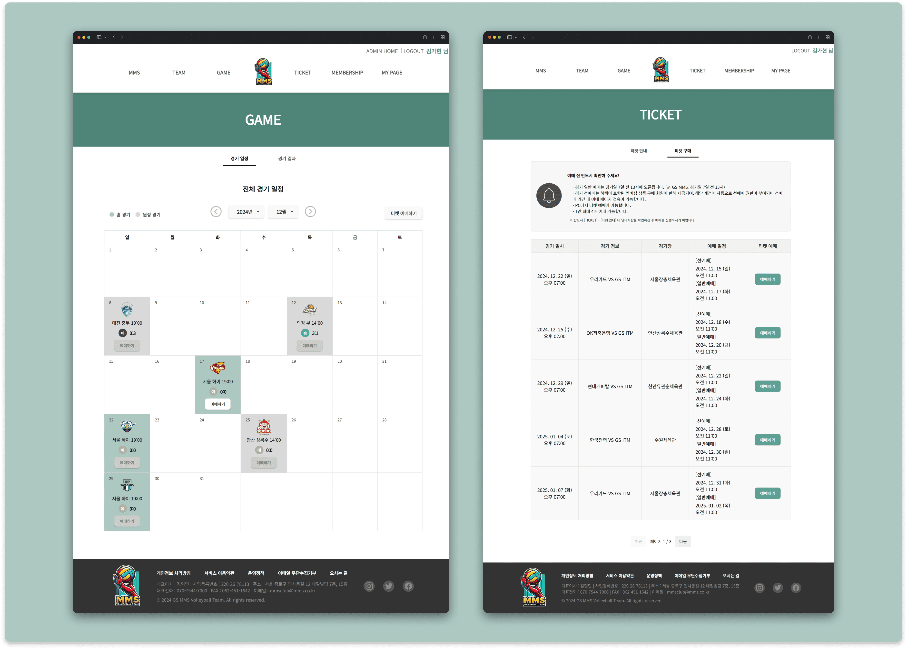
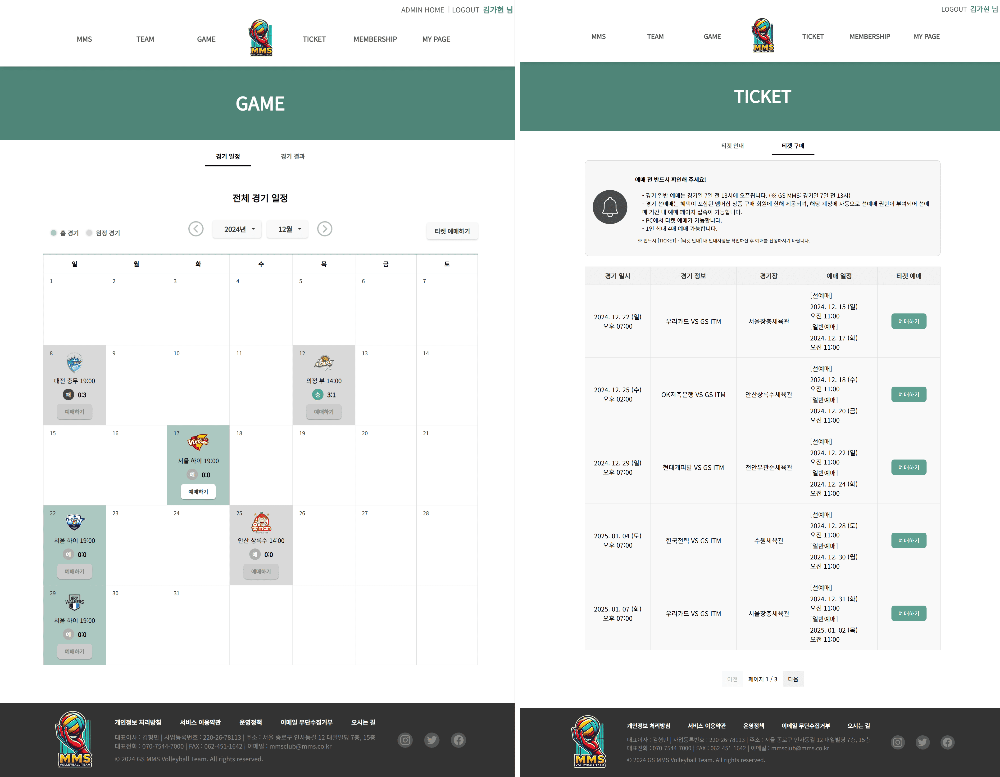
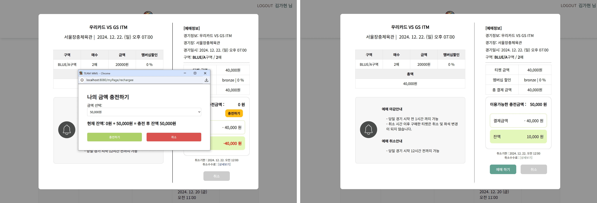
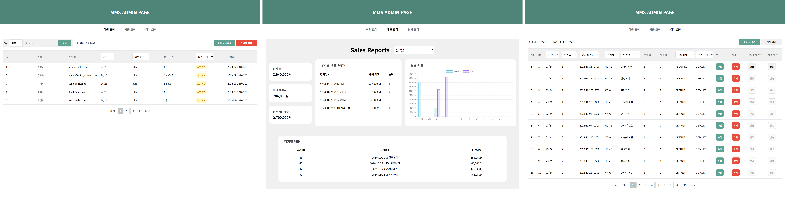
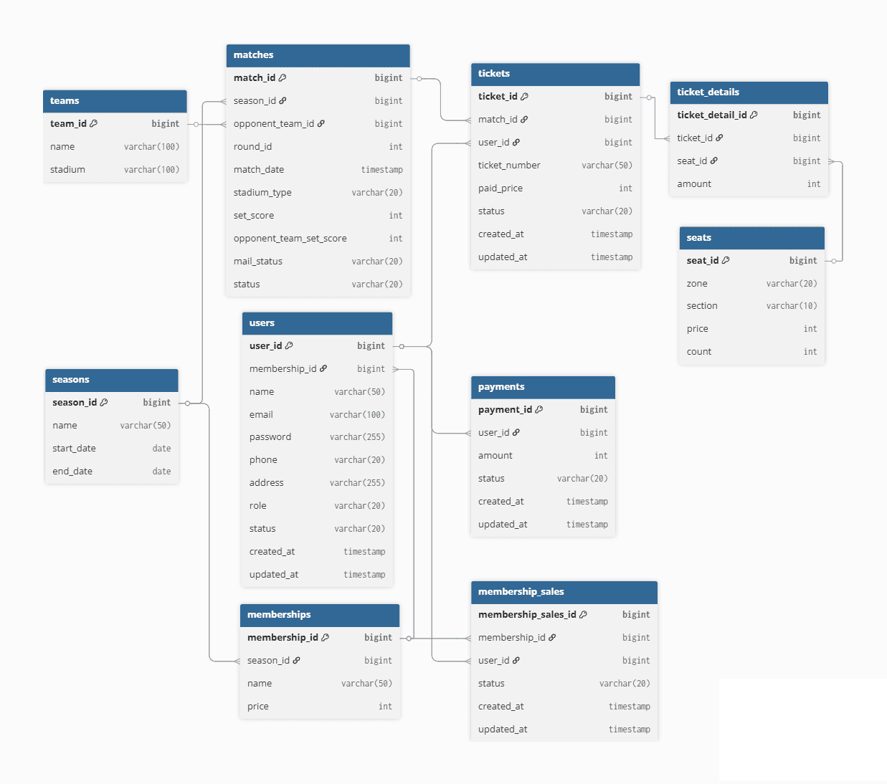

# MMS Volleyball Project

 

사용자와 관리자 페이지를 분리하여 구현한 **배구단 웹 서비스 프로젝트**이다.

 

사용자는 경기 일정 조회, 티켓 예매, 멤버십 구매를 할 수 있으며,

관리자는 경기 및 회원 데이터를 관리하고 매출을 확인할 수 있다.

 

## 📅 프로젝트 정보

- **유형**: 팀 프로젝트

- **기간**: 2024.10.18 ~ 2024.11.03 (약 2주)

- **인원**: 5명

 

## 🛠 기술 스택

- **프론트엔드:** Vue.js, JavaScript, CSS, Thymeleaf

- **백엔드:** Spring Boot, Java, JPA

- **인증/보안:** Spring Security, JWT

- **데이터베이스:** PostgreSQL

- **기타:** GitHub, Notion, Postman, DBeaver

 

## 🚀 주요 기능

### 사용자 페이지

- 회원가입 및 로그인

- 경기 일정 및 결과 조회

- 티켓 및 멤버십 구매

- 마이페이지 (예매 내역, 멤버십, 정보 관리)

 

### 관리자 페이지

- 회원 및 관리자 계정 관리

- 매출 조회 및 통계 확인

- 경기 관리

- 경기 변경 시 사용자 안내 메일 발송

 

## 🧩 담당 역할

### 사용자 페이지

- 전체 레이아웃 및 UI 구조 설계

- 구단, 팀, 구장 등 소개 페이지 구현

- 캘린더 기반 경기 일정 조회 및 필터링 기능 구현

- 경기 결과 조회 및 페이징 처리

### 관리자 페이지

- 관리자 페이지 UI 스타일 통일

- 경기 관리 페이지 CRUD 기능 구현

- 다중 조건 기반 경기 조회 기능 구현

- 경기 수정/삭제 시 사용자 안내 메일 발송 기능 구현

 

## 💡 주요 구현 포인트

### 1) 사용자 / 관리자 페이지 구조 분리

- 사용자 페이지: Vue 기반 CSR

- 관리자 페이지: Thymeleaf 기반 SSR

- 페이지 성격에 따라 렌더링 방식을 분리하여 구현

### 2) 다중 조건 조회

- 조건이 존재할 때만 필터링이 적용되도록 구현

- Pageable + Sort를 활용한 페이지네이션 및 정렬 처리

### 3) 상태 기반 메일 발송

- 경기 상태와 메일 상태를 분리하여 관리

- 변경/취소 시 메일 발송이 필요한 상태로 설정

- 관리자 확인 후 메일 발송

### 4) 논리 삭제 (Soft Delete)

- 데이터 삭제 대신 상태값 변경 방식 적용

- 참조 무결성 유지

 

## 🔗 상세 구현 및 회고

- 🔗 [프로젝트 소개 및 회고](https://velog.io/@kimkaaa/MMS-Volleyball-Project-%ED%94%84%EB%A1%9C%EC%A0%9D%ED%8A%B8-%EC%86%8C%EA%B0%9C-%EB%B0%8F-%ED%9A%8C%EA%B3%A0)

- 🔗 [Vue와 Thymeleaf로 사용자/관리자 페이지 구현](https://velog.io/@kimkaaa/MMS-Volleyball-Project-Vue%EC%99%80-Thymeleaf%EB%A1%9C-%EC%82%AC%EC%9A%A9%EC%9E%90%EA%B4%80%EB%A6%AC%EC%9E%90-%ED%8E%98%EC%9D%B4%EC%A7%80-%EA%B5%AC%ED%98%84)

- 🔗 [관리자 경기 관리 기능 구현](https://velog.io/@kimkaaa/MMS-Volleyball-Project-%EA%B4%80%EB%A6%AC%EC%9E%90-%EA%B2%BD%EA%B8%B0-%EA%B4%80%EB%A6%AC-%EA%B8%B0%EB%8A%A5-%EA%B5%AC%ED%98%84)

- 🔗 [경기 일정 안내 메일 발송 기능 구현](https://velog.io/@kimkaaa/MMS-Volleyball-Project-%EA%B2%BD%EA%B8%B0-%EC%9D%BC%EC%A0%95-%EC%95%88%EB%82%B4-%EB%A9%94%EC%9D%BC-%EB%B0%9C%EC%86%A1-%EA%B8%B0%EB%8A%A5-%EA%B5%AC%ED%98%84)

 

## 🗂 데이터베이스 설계

  
<b>ERD</b>

   
  

 

  
<b>테이블 정의서</b>

   
    🔗 
  <a href="https://docs.google.com/spreadsheets/d/1zAh76IH-L91-8-NUpKZm-VNkRd3EKwYvFaAq6B6b4JY/edit?usp=sharing" target="_blank">
    테이블 정의서 확인하기
  </a>

 

## 📝 회고

단순 CRUD 구현을 넘어서

데이터의 흐름과 실제 사용 시나리오를 고려하는 경험을 할 수 있었다.

특히 사용자/관리자 구조 분리, 상태 기반 기능 설계,

데이터 정합성을 고려한 로직 구현 등을 통해

서비스 관점에서 기능을 바라보는 시각을 넓힐 수 있었다.