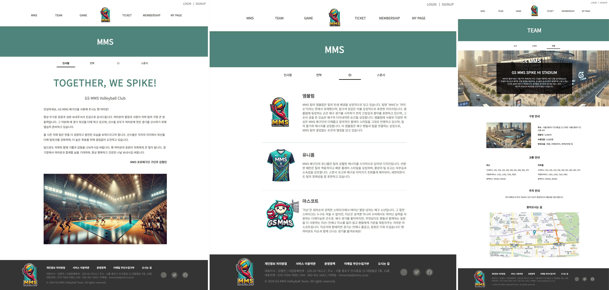
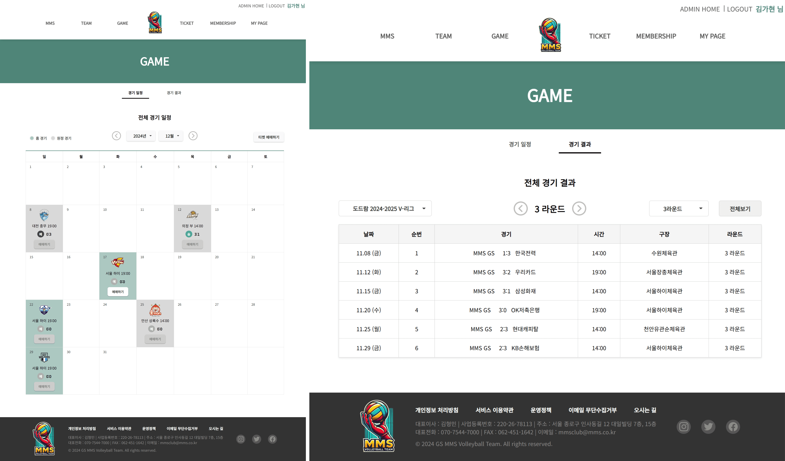
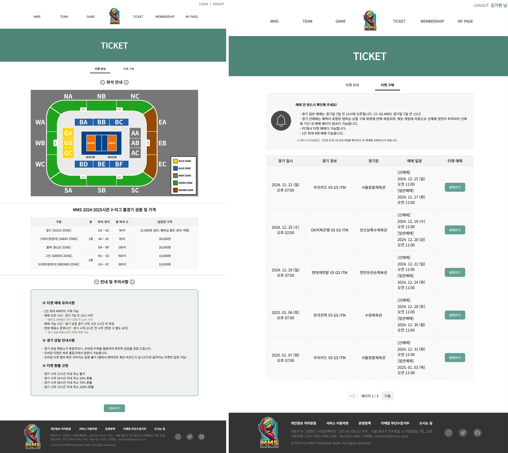
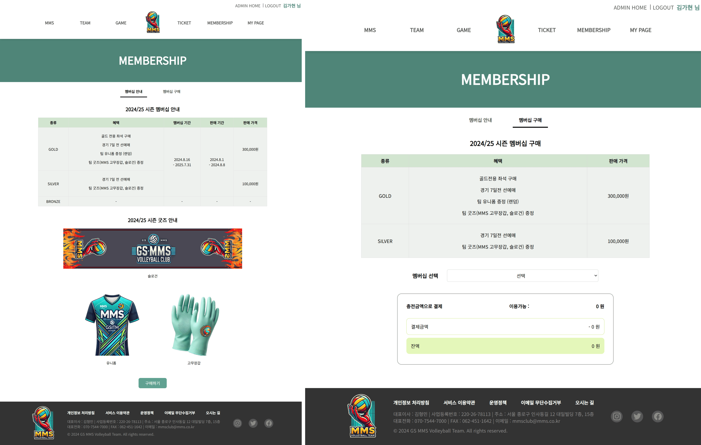
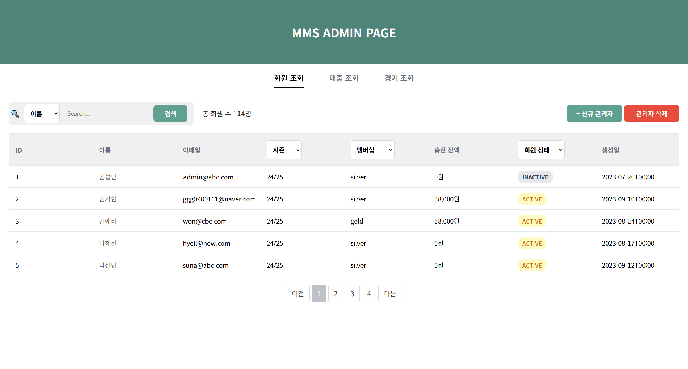
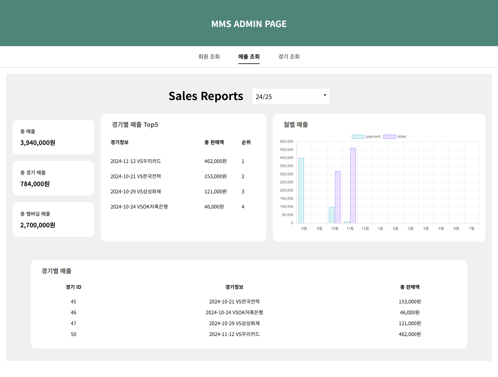
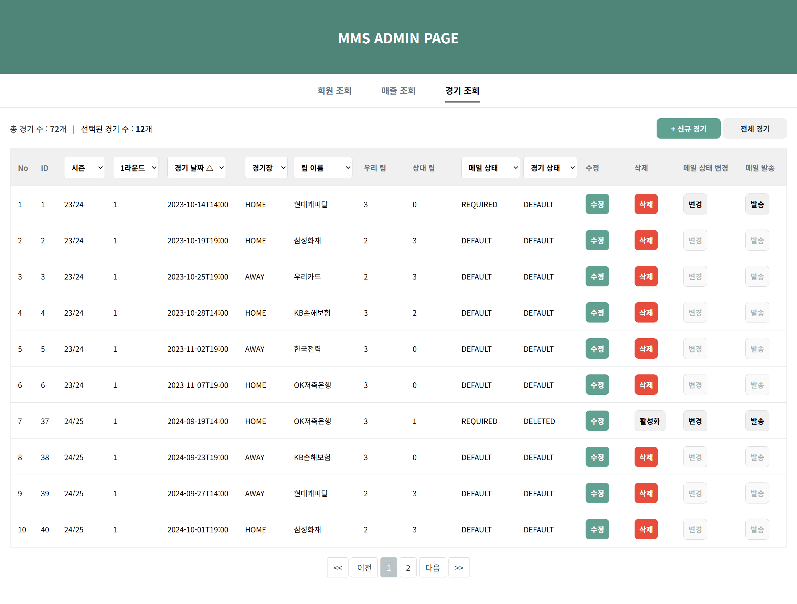
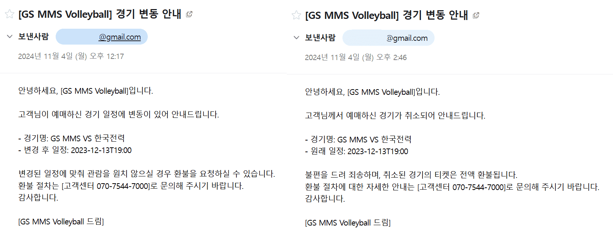

# MMS Volleyball Project

 

사용자와 관리자 페이지를 분리하여 구현한 **배구단 웹 서비스 프로젝트**입니다.

 

사용자는 경기 일정 조회, 티켓 예매, 멤버십 구매 기능을 이용할 수 있으며,

관리자는 경기 및 회원 데이터를 관리하고 매출을 확인할 수 있습니다.

 
 

## 프로젝트 정보

- **유형**: 팀 프로젝트

- **기간**: 2024.10.18 ~ 2024.11.03 (약 2주)

- **인원**: 5명

 
 

## 기술 스택

- **프론트엔드:** Vue.js, JavaScript, CSS, Thymeleaf

- **백엔드:** Spring Boot, Java, JPA

- **인증/보안:** Spring Security, JWT

- **데이터베이스:** PostgreSQL

- **기타:** GitHub, Notion, Postman, DBeaver

 
 

## 주요 기능

### 사용자 페이지

- 회원가입 및 로그인

- 경기 일정 및 결과 조회

- 티켓 및 멤버십 구매

- 마이페이지 (예매 내역, 멤버십, 정보 관리)

 

### 관리자 페이지

- 회원 및 관리자 계정 관리

- 매출 조회 및 통계 확인

- 경기 관리

- 경기 변경 시 사용자 안내 메일 발송

 
 

## 실행 화면

### 사용자 페이지

  
<b>구단 소개</b>

   
  

 

  
<b>경기 일정 및 결과 조회</b>

   
  

 

  
<b>티켓 안내 및 구매</b>

   
  

 

  
<b>충전 및 티켓 구매 모달</b>

   
  

 

  
<b>멤버십 안내 및 구매</b>

   
  

 

### 관리자 페이지

  
<b>회원 및 관리자 계정 관리</b>

   
  

 

  
<b>매출 조회</b>

   
  

 

  
<b>경기 관리 및 메일 발송</b>

   
  

 

  
<b>메일 발송 결과</b>

   
  

 
 

## 담당 역할

### 사용자 페이지

- 전체 레이아웃 및 UI 구조 설계

- 구단, 팀, 구장 등 소개 페이지 구현

- 캘린더 기반 경기 일정 조회 및 필터링 기능 구현

- 경기 결과 조회 및 페이징 처리

### 관리자 페이지

- 관리자 페이지 UI 스타일 통일

- 경기 관리 페이지 CRUD 기능 구현

- 다중 조건 기반 경기 조회 기능 구현

- 경기 수정/삭제 시 사용자 안내 메일 발송 기능 구현

 
 

## 주요 구현 내용

### 1) 사용자 / 관리자 페이지 구조 분리

- 사용자 페이지: Vue 기반 CSR

- 관리자 페이지: Thymeleaf 기반 SSR

- 페이지 성격에 따라 렌더링 방식을 분리하여 구현

### 2) 다중 조건 조회

- 조건이 존재할 때만 필터링이 적용되도록 구현

- Pageable + Sort를 활용한 페이지네이션 및 정렬 처리

### 3) 상태 기반 메일 발송

- 경기 상태와 메일 상태를 분리하여 관리

- 변경/취소 시 메일 발송이 필요한 상태로 설정

- 관리자 확인 후 메일 발송

### 4) 논리 삭제 (Soft Delete)

- 데이터 삭제 대신 상태값 변경 방식 적용

- 참조 무결성 유지

 
 

## 개발 기록 및 후기

- 🔗 [프로젝트 소개 및 회고](https://velog.io/@kimkaaa/MMS-Volleyball-Project-%ED%94%84%EB%A1%9C%EC%A0%9D%ED%8A%B8-%EC%86%8C%EA%B0%9C-%EB%B0%8F-%ED%9A%8C%EA%B3%A0)

- 🔗 [Vue와 Thymeleaf로 사용자/관리자 페이지 구현](https://velog.io/@kimkaaa/MMS-Volleyball-Project-Vue%EC%99%80-Thymeleaf%EB%A1%9C-%EC%82%AC%EC%9A%A9%EC%9E%90%EA%B4%80%EB%A6%AC%EC%9E%90-%ED%8E%98%EC%9D%B4%EC%A7%80-%EA%B5%AC%ED%98%84)

- 🔗 [관리자 경기 관리 기능 구현](https://velog.io/@kimkaaa/MMS-Volleyball-Project-%EA%B4%80%EB%A6%AC%EC%9E%90-%EA%B2%BD%EA%B8%B0-%EA%B4%80%EB%A6%AC-%EA%B8%B0%EB%8A%A5-%EA%B5%AC%ED%98%84)

- 🔗 [경기 일정 안내 메일 발송 기능 구현](https://velog.io/@kimkaaa/MMS-Volleyball-Project-%EA%B2%BD%EA%B8%B0-%EC%9D%BC%EC%A0%95-%EC%95%88%EB%82%B4-%EB%A9%94%EC%9D%BC-%EB%B0%9C%EC%86%A1-%EA%B8%B0%EB%8A%A5-%EA%B5%AC%ED%98%84)

 
 

## 데이터베이스 설계

  
<b>ERD</b>

   
  

 

  
<b>테이블 정의서</b>

   
    🔗 
  <a href="https://docs.google.com/spreadsheets/d/1zAh76IH-L91-8-NUpKZm-VNkRd3EKwYvFaAq6B6b4JY/edit?usp=sharing" target="_blank">
    테이블 정의서 확인하기
  </a>

 
 

## 후기

이번 프로젝트는 처음 진행한 팀 프로젝트로, 프론트엔드와 백엔드를 모두 구현하며 전체 개발 흐름을 경험할 수 있었습니다.

또한 Git을 활용한 협업 역시 처음이었기 때문에, 개발뿐만 아니라 협업 과정 자체를 익히는 데에도 의미가 있었습니다.

 

초기에는 충분히 기획과 구조를 정리했다고 생각했지만,

실제 개발 과정에서는 기획과 구현 사이의 차이로 인해 수정과 조율이 반복되었고, 이를 통해 설계 단계의 중요성을 느낄 수 있었습니다.

 

여러 명이 함께 개발하면서 구조를 어떻게 나눌지에 대한 고민이 컸고,

초기에는 엔티티 기준으로 나누었던 구조를 기능 단위로 재정리하며 협업에 더 적합한 방향으로 개선할 수 있었습니다.

또한 Git 협업 과정에서 충돌과 코드 누락을 직접 겪으며, 작업 흐름을 공유하고 맞추는 것이 중요하다는 점을 체감했습니다.

 

기능 구현 측면에서는 단순 CRUD를 넘어서 데이터 간 관계와 실제 사용 흐름을 고려하게 되었고,

논리 삭제와 메일 발송 기능을 추가하면서 이를 반영할 수 있었습니다.

 

또한 Vue 기반 사용자 페이지와 Thymeleaf 기반 관리자 페이지를 각각 구현하면서

CSR과 SSR의 차이, 상태 기반 UI와 서버 렌더링 흐름을 비교해볼 수 있었고,

컴포넌트 구조와 데이터 흐름에 대해서도 고민해볼 수 있었습니다.

 

이번 프로젝트를 통해 구현뿐만 아니라 구조, 협업, 데이터 흐름까지 함께 고려해야 한다는 것을 배우게 되었고,

다음 프로젝트에서는 초기 설계와 협업 기준을 더 명확히 잡고 진행하고자 하는 방향성을 갖게 되었습니다.